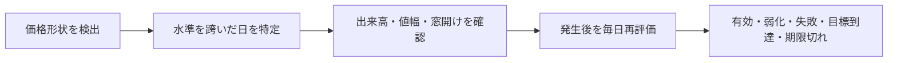
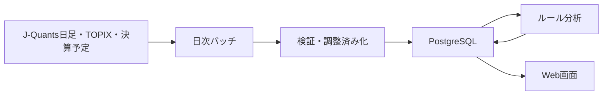

# はじめての株式テクニカル分析とTOMOSHIBIYORIの読み方

## この文書について

この文書は、株式投資やテクニカル分析を初めて学ぶ人が、TOMOSHIBIYORIの画面に表示される
「上昇」「様子見」「ATR」「出来高倍率」「無効化水準」などの意味を、基礎から理解するための
入門教材です。高校数学の割合、平均、グラフを理解していれば読めるように説明します。

この文書を読み終えたとき、次のことを自分の言葉で説明できる状態を目標にします。

- 株価が上がることと、良い企業であることの違い。
- ローソク足と出来高が何を表すか。
- 移動平均、モメンタム、RSI、ATRの役割。
- チャートパターンを「永続する予言」ではなく「ある日に起きたイベント」と考える理由。
- TOMOSHIBIYORIの「テクニカル方向」と「投資検討区分」の違い。
- 無効化水準、参考目標、リスクリワード、購入上限株数の関係。
- ルールベース分析にできることと、できないこと。

具体的な閾値や実装式を確認したい場合は、この文書を読んだ後に
[投資判断ロジック入門](investment-judgment-guide.md)を参照してください。

### 読み方の目安

| 目的 | 推奨する節 |
|---|---|
| 最初から体系的に学ぶ | 第1節から順番に読む |
| ローソク足と基本指標を知る | 第2〜5節 |
| パターンと転換段階を知る | 第6〜7節 |
| TOPIX・決算・流動性を知る | 第8〜9節 |
| 損失管理と株数計算を知る | 第10〜11節 |
| 画面を正しく読みたい | 第12〜14節、第16〜17節 |
| システムの限界を知る | 第15節 |
| 用語だけ確認したい | 第18節 |

> **重要**
> この文書とアプリの表示は、学習・分析のための情報です。利益を保証する投資助言ではありません。
> 企業価値、財務、税金、手数料、生活資金、他の保有資産などを含めた最終判断は利用者自身が
> 行う必要があります。

## 1. 株式投資では何を判断しているのか

### 1.1 株式と株価

株式は、企業に対する持分です。株式を保有すると、企業の利益や資産に対する権利の一部を持つことに
なります。一方、株価は市場で実際に売買された価格です。企業の価値と株価は関係しますが、同じもの
ではありません。

例えば、業績が良い企業でも、市場参加者がそれ以上の成長をすでに期待して高い価格を付けていれば、
決算発表後に株価が下がることがあります。反対に、業績が悪くても「想定ほど悪くなかった」という
理由で株価が上がることもあります。

投資判断には、大きく分けて次の2種類の問いがあります。

| 分析 | 主な問い | 代表的な情報 |
|---|---|---|
| ファンダメンタル分析 | この企業を長く保有する価値があるか | 売上、利益、財務、競争力、配当、経営方針 |
| テクニカル分析 | 現在の価格と需給はどちらへ動いているか | 株価、出来高、値幅、チャート形状、市場全体 |

TOMOSHIBIYORIが主に扱うのは後者です。したがって「購入候補」は「優良企業」という意味では
ありません。価格面の条件が整った可能性を示すだけです。

実際に株式を購入するときは、分析方法だけでなく次の4層を分けて考えると整理しやすくなります。

| 層 | 問い | TOMOSHIBIYORIの範囲 |
|---|---|---|
| 投資対象 | どの企業を保有したいか | 原則として範囲外。企業価値は別途確認 |
| 売買時機 | 価格面の条件は整ったか | テクニカル方向、パターン、転換条件で補助 |
| 資金管理 | 外れたとき、いくらまで損失を許容するか | 無効化水準と購入上限計算で補助 |
| 注文・運用 | どの注文方法で執行し、保有後どう管理するか | 現在は自動注文せず、最終判断は範囲外 |

### 1.2 リターンと損失

株価が1,000円から1,100円になったとき、騰落率は次のように計算します。

```text
騰落率 = (新しい価格 / 元の価格 - 1) × 100
       = (1,100 / 1,000 - 1) × 100
       = 10%
```

一方、1,000円から900円へ下がった場合は-10%です。ただし、10%下落した後に元へ戻るためには
10%ではなく約11.1%の上昇が必要です。

```text
900円 × 1.111... = 1,000円
```

この非対称性があるため、投資では「どれだけ儲かりそうか」だけでなく「判断が外れたとき、どこで
前提を見直すか」が重要です。TOMOSHIBIYORIが無効化水準と購入上限株数を表示するのはこのためです。

## 2. 日足データの基礎

### 2.1 OHLCV

本アプリは日単位の`OHLCV`を使います。

| 記号 | 日本語 | 意味 |
|---|---|---|
| O | 始値（Open） | その日の最初の取引価格 |
| H | 高値（High） | その日の最も高い取引価格 |
| L | 安値（Low） | その日の最も低い取引価格 |
| C | 終値（Close） | その日の最後の取引価格 |
| V | 出来高（Volume） | その日に売買された株数 |

例えば、始値1,000円、高値1,080円、安値980円、終値1,060円なら、日中に一度980円まで売られた
ものの、最後は始値より高く終わったことが分かります。

### 2.2 ローソク足

ローソク足はOHLCを一つの図形にまとめたものです。

- 実体は始値と終値の間を表す。
- 上ヒゲは実体から高値までを表す。
- 下ヒゲは実体から安値までを表す。
- 終値が始値より高ければ陽線、低ければ陰線と呼ぶ。

一本の陽線だけで将来の上昇は決まりません。しかし、多数の日足を並べると、買い手と売り手の力関係、
値動きの方向、価格が止まりやすい帯を観察できます。

### 2.3 出来高

株価は「いくらで取引されたか」、出来高は「どれだけ取引されたか」です。同じ3%上昇でも、普段の
半分の出来高しかない場合と、普段の2倍の出来高がある場合では、参加した資金の広がりが異なります。

ただし、出来高が多いだけでは上昇要因になりません。大幅下落の日にも出来高は増えます。そのため、
本アプリは価格がどちらへ動いたかと組み合わせて使います。

### 2.4 調整済み株価

1株を2株に分ける株式分割があると、理論上は株価が半分になります。企業価値が一夜で半分になった
わけではありません。未調整の系列をそのままチャートへつなぐと、巨大な暴落として誤認します。

そこで過去の価格と出来高を同じ基準へそろえたものが調整済み株価です。TOMOSHIBIYORIはJ-Quantsの
未調整値を監査用に残し、チャートと分析には調整済みOHLCVを使います。

## 3. 価格の方向をどう捉えるか

### 3.1 トレンドと停滞

日々の株価は一直線には動きません。小さく上下しながら、全体として次のいずれかの状態になります。

- 高値と安値を切り上げる上昇トレンド。
- 高値と安値を切り下げる下降トレンド。
- 一定範囲を往復する停滞・持ち合い。

「今日は上がった」ことと「上昇トレンドである」ことは違います。下降トレンドの途中にも反発日は
あります。本アプリが直近数日と20日・60日の両方を見るのは、短い反発と大きな方向を分けるためです。

### 3.2 移動平均

5日移動平均は、直近5営業日の終値の平均です。

```text
終値: 100, 102, 101, 104, 108
5日平均 = (100 + 102 + 101 + 104 + 108) / 5 = 103
```

平均を毎日一日ずつずらして計算し、線で結んだものが移動平均線です。短期線が長期線より上にあり、
長期線自体も上向きなら、最近の価格が過去の平均より強いと解釈できます。

一方、移動平均は過去の価格から計算するため遅れます。上昇が始まった後に上向きになり、下落が
始まった後に下向きになります。将来を先に知る線ではありません。

### 3.3 モメンタム

モメンタムは、ある期間で価格がどの程度変化したかを表します。本アプリでは期間騰落率やATR換算の
変化を使います。

```text
10日前の終値 = 1,000円
現在の終値   = 1,060円
10日モメンタム = (1,060 / 1,000 - 1) × 100 = 6%
```

モメンタムがプラスでも、すでに急上昇して買われ過ぎている場合があります。逆にマイナスでも、下落が
止まりかけている場合があります。このため単独ではなく、移動平均、値幅、出来高と組み合わせます。

### 3.4 RSI

RSIは、一定期間の上昇幅と下落幅を比べて、値動きの偏りを0から100で表す指標です。

```text
平均上昇幅 = 期間内のプラス変化の平均
平均下落幅 = 期間内のマイナス変化の絶対値の平均
RS = 平均上昇幅 / 平均下落幅
RSI = 100 - 100 / (1 + RS)
```

一般に70超は買われ過ぎ、30未満は売られ過ぎと呼ばれます。しかし、強い上昇中は70超が長く続く
ことがあります。「70を超えたから明日下落する」とは限りません。TOMOSHIBIYORIは過熱状態を
警戒情報として扱い、それだけで反転方向を決めません。

## 4. 値動きの大きさをそろえるATR

### 4.1 なぜ円では比較しにくいのか

株価500円の銘柄が一日20円動くことと、株価20,000円の銘柄が20円動くことは同じではありません。
また、普段10円しか動かない銘柄の50円変動と、普段500円動く銘柄の50円変動も意味が違います。

そこで、その銘柄自身の通常の値幅を物差しにするのがATRです。

### 4.2 TRとATR

当日の高値と安値の差だけでは、前日終値から窓を開けて始まった値動きを捉えられません。TRは次の
3つのうち最大の値を使います。

```text
TR = max(
  当日高値 - 当日安値,
  |当日高値 - 前日終値|,
  |当日安値 - 前日終値|
)
```

ATRはTRを平滑化した値です。本アプリは20本を初期平均とし、その後をWilder方式で更新します。

```text
翌日のATR = (前日のATR × 19 + 当日のTR) / 20
```

例えばATRが100円なら、0.5 ATRは50円、1.5 ATRは150円です。銘柄ごとに異なる通常値幅を
「ATRの何倍か」という共通単位へ変換できます。

### 4.3 ATRが示さないこと

ATRは値動きの大きさを表し、上昇・下落の方向は表しません。ATRが大きい銘柄は上昇しやすいのでは
なく、上下どちらにも大きく動きやすい銘柄です。

## 5. 支持線、抵抗線、ブレイク

### 5.1 支持線と抵抗線

過去に何度も下げ止まった価格帯を支持線、何度も上げ止まった価格帯を抵抗線と呼びます。正確な
一本の線というより、多くの市場参加者が意識しやすい価格帯と考える方が自然です。

- 支持線付近では、安いと考える買い手が増える可能性がある。
- 抵抗線付近では、利益確定や戻り売りが増える可能性がある。

### 5.2 ブレイクは「その日」に起きる

終値が抵抗線を超えた状態を上方ブレイクと呼びます。重要なのは、水準より上にいる状態が何日も
続いても、ブレイクしたイベントは最初に跨いだ一日だけという点です。

```text
前日終値 <= 抵抗線
かつ
当日終値 > 抵抗線
```

TOMOSHIBIYORIはこのクロスを検出します。抵抗線より上にいるだけの日を毎日新しいブレイクとして
数えません。

### 5.3 ブレイク幅と出来高

抵抗線を1円だけ超えた場合は、日常的な揺れで戻る可能性があります。本アプリは超えた幅をATRで
標準化し、完成ブレイクでは0.1 ATR以上を要求します。また、出来高が平常時中央値の1.5倍以上かを
確認します。

中央値とは、数値を小さい順に並べた中央の値です。平均値よりも、一日だけの異常な大商いに
引っ張られにくいため、普段の出来高を表す基準に使います。

### 5.4 窓開け

前日終値と翌日始値の間に大きな差があることを窓開けと呼びます。

```text
窓開けの大きさ = (当日始値 - 前日終値) / ATR
```

決算や重要ニュースで1.5 ATRを超える窓が開いた場合、ゆっくり形成されたチャート形状より、新しい
情報によって価格水準そのものが変わった可能性があります。本アプリは通常ブレイクと分けて
「様子見」にします。

## 6. チャートパターンの考え方

### 6.1 パターンは予言ではない

ダブルボトム、レクタングル、三角持ち合いなどは、過去の価格形状に付けた名前です。同じ形が出ても、
将来必ず同じ動きをするわけではありません。形状は、市場参加者の売買がある価格帯で繰り返された
結果として観察できる情報です。

本アプリは次の順番で扱います。



### 6.2 主なパターン

| パターン | 形の概要 | 確認するイベント |
|---|---|---|
| レクタングル | 上限と下限の間を往復 | 上限突破または下限割れ |
| アセンディング・トライアングル | 上値は一定で安値が切り上がる | 上値抵抗の突破 |
| ディセンディング・トライアングル | 下値は一定で高値が切り下がる | 下値支持の割れ |
| ダブルボトム | 近い水準で2回安値を付ける | 間の高値であるネックライン突破 |
| ダブルトップ | 近い水準で2回高値を付ける | 間の安値であるネックライン割れ |
| ヘッド＆ショルダーズ | 中央の山・谷が最も大きい3点形状 | ネックライン突破・割れ |

画面のパターン一致度は、局所的な高値・安値、傾き、左右の形などが実装上の理想条件にどれだけ
一致したかを0〜100で表すヒューリスティックです。一致度80は、80%の確率で成功するという意味では
ありません。

### 6.3 発生後の寿命

ブレイク後も永久に上昇・下落が続くとは考えません。本アプリは次のように区切ります。

- 発生から5営業日以内は新規検討期間。
- 6〜20営業日は新規追随より保有管理を優先。
- 20営業日を超えたら古いシグナルとして期限切れ。
- 直近の価格が期待方向へ逆行すれば勢い弱化。
- 無効化水準を越えれば失敗。
- 形成値幅から計算した目標へ届けば目標到達。

この仕組みにより「昔ダブルボトムがあったから今も上昇」という誤った読み方を避けます。

## 7. 上昇する前の準備段階

下落している銘柄が安く見えても、下落が続けばさらに安くなります。本アプリは、安いこと自体では
なく、下落が止まり上昇へ移る条件がどこまで整ったかを表示します。

```text
下降継続
  → 底固め観察
  → 転換準備
  → あと1条件
  → 転換初動
  → 完成ブレイク後の上昇確認
```

主な確認項目は次のとおりです。

1. 一定期間、安値を更新していない。
2. 短期または中期モメンタムが改善した。
3. 終値が仮の転換水準の0.2 ATR下から0.1 ATR上にある。
4. 転換水準と形成安値の差が0.5 ATR以上ある。
5. 出来高が平常時の1.2倍以上に増えた。
6. 1.5 ATRを超える大きな窓開けではない。

「転換初動」は、完成ブレイクより早い観察段階です。購入候補ではなく様子見として表示します。
完成ブレイクでは、より厳しい0.1 ATR上抜けと出来高1.5倍を確認します。

条件進捗が`5 / 6`なら、6条件中5条件を満たしたという意味です。上昇確率83.3%という意味では
ありません。

## 8. 市場全体との比較

### 8.1 TOPIX

TOPIXは東京証券取引所の株式市場全体の動きを見る代表的な指数です。個別株が2%上がっても、TOPIXが
8%上がっていれば、市場全体より6ポイント弱かったと考えられます。

### 8.2 相対力

本アプリの相対力は次の単純な差です。

```text
相対力 = 対象株の期間騰落率 - TOPIXの期間騰落率
```

対象株が+5%、TOPIXが+2%なら相対力は+3%です。対象株が-1%、TOPIXが-5%なら相対力は+4%で、
絶対的には下落していても市場よりは強いことを示します。

相対力は「現在の期間で市場より強かった」という事実であり、次の期間も強い保証ではありません。

### 8.3 ベータ

ベータは、市場の日々の変化に対して個別株がどの程度連動して動いたかを表す統計量です。

```text
ベータ = 個別株とTOPIXの日次騰落率の共分散 / TOPIX日次騰落率の分散
```

直感的には次のように読みます。

- ベータが約1なら、市場と同程度に動く傾向。
- ベータが1より大きければ、市場変動に対して値動きが大きい傾向。
- 0に近ければ、市場との日々の連動が弱い傾向。
- 負なら、計算期間では市場と反対方向に動く傾向。

ベータは原因や将来の利益を示しません。計算期間が変われば値も変わります。本アプリではリスク特性を
理解する補助情報として表示します。

### 8.4 流動性

流動性は、希望する価格に近いところで売買しやすい度合いです。出来高が極端に少ない銘柄では、買いたい
価格と実際に買える価格、売りたい価格と実際に売れる価格の差が大きくなることがあります。

本アプリはJ-Quants日本株について、直近60営業日（不足時は取得可能な20営業日以上）の
日次売買代金中央値を次のように計算し、暫定的な流動性スコアを付けます。

```text
日次売買代金 = 終値 × 出来高
```

| 売買代金中央値 | 暫定スコア |
|---|---:|
| 10億円以上 | 100点 |
| 3億円以上10億円未満 | 75点 |
| 1億円以上3億円未満 | 50点 |
| 1億円未満 | 25点 |

このスコアには、実際の注文板、売値と買値の差であるスプレッド、注文による価格変化を含みません。
また、円建てを前提にするため、通貨情報がそろわない取得元には同じ閾値を適用しません。

## 9. 決算とイベントリスク

決算発表では、売上・利益だけでなく、会社予想や市場の期待との差が一度に価格へ反映されます。そのため、
テクニカル条件が良くても、発表翌日に大きく窓を開ける可能性があります。

TOMOSHIBIYORIは現在、決算予定日までの暦日差を使います。

- 5日以内なら、購入候補の条件を満たしても「様子見」にする。
- 6日後から分析期間内なら、区分を維持して警告を表示する。
- 決算内容や決算以外の適時開示は、現在のLightプランだけでは評価しない。

決算前を一律20日間除外しないのは、日本企業の多くが年4回決算を発表し、候補が長期間なくなることを
避けるためです。ただし、決算をまたいで保有するかは別のリスク判断です。

## 10. 無効化水準、目標、リスクリワード

### 10.1 無効化水準

無効化水準は「ここまで戻ったら、最初のチャート上の前提が崩れたとみなす」参考価格です。利益を
最大化する価格ではなく、判断が外れたことを認識するための境界です。

上向きの場合、本アプリは形成安値と転換水準の0.5 ATR下を比べ、低い方からさらに0.1 ATR下へ
余裕を置きます。

```text
無効化水準
  = min(形成安値, 転換水準 - 0.5 × ATR) - 0.1 × ATR
```

`min`は2つのうち小さい方を選ぶ関数です。浅すぎる形成安値だけに合わせて損切り幅が極端に狭くなる
ことを避けます。一方、無効化水準が遠くなるほど1株あたりの損失余地は大きくなります。

### 10.2 参考目標

パターンの高さを、転換水準から上へ足した価格を参考目標とします。

```text
パターンの高さ = 転換水準 - 形成安値
参考目標 = 転換水準 + パターンの高さ
```

これはメジャード・ムーブと呼ばれる考え方です。到達確率を表すものではありません。形成値幅が
0.5 ATR未満なら、目標を人工的に広げず、形状条件を未達にします。

### 10.3 リスクリワード

現在値から無効化水準までをリスク、現在値から参考目標までをリワードとして比率を計算します。

```text
参考R/R = (参考目標 - 現在値) / (現在値 - 無効化水準)
```

例として、転換水準2,000円、形成安値1,800円、ATR100円、現在値2,020円を考えます。

```text
無効化水準 = min(1,800, 2,000 - 50) - 10 = 1,790円
参考目標   = 2,000 + (2,000 - 1,800) = 2,200円
リスク      = 2,020 - 1,790 = 230円
リワード    = 2,200 - 2,020 = 180円
参考R/R     = 180 / 230 ≒ 0.78
```

形成安値を守る保守的な無効化水準では、R/Rが1未満になることもあります。本アプリは都合よく目標を
広げず、そのまま表示します。

## 11. 購入上限株数と損失管理

同じ銘柄を買う場合でも、100株と1,000株では損失額が10倍になります。良い購入タイミングを探す
こと以上に、一回の判断で失ってよい金額を先に決めることが重要です。

```text
1株あたりリスク = 現在値 - 無効化水準
理論上限株数 = floor(許容損失額 / 1株あたりリスク)
```

前節の例で許容損失額を50,000円とすると、次のようになります。

```text
1株あたりリスク = 230円
理論上限株数 = floor(50,000 / 230) = 217株
100株単位の参考上限 = 200株
必要資金の目安 = 2,020円 × 200株 = 404,000円
```

実際には手数料、スリッページ、窓開けで無効化水準より不利に約定する損失を含みません。また、ETF
などでは売買単位が100株とは限りません。表示は購入推奨株数ではなく、上限を考える電卓です。

## 12. TOMOSHIBIYORIの3種類の出力

### 12.1 テクニカル方向

「上昇・停滞・下落」は、現在の価格要因を合算した方向です。移動平均、モメンタム、直近トレンド、
RSI、出来高、パターンの現在状態などを使います。

### 12.2 投資検討区分

「購入候補・様子見・新規購入回避」は、ロング中心で次に何を確認するかを表す区分です。

| 区分 | 意味 | 代表的な次の行動 |
|---|---|---|
| 購入候補 | 完成ブレイクと確認条件がそろった | 企業内容、価格リスク、資金量を追加確認する |
| 様子見 | 条件不足、転換準備、決算接近など | 未達条件やイベント通過を待つ |
| 新規購入回避 | 下落要因、下降パターン、上抜け失敗など | 新規購入・買い増しを止め、前提を見直す |

テクニカル方向が上昇でも、出来高不足や決算接近なら様子見になります。方向と区分が異なるのは
矛盾ではなく、役割が違うためです。

本アプリは買いから入るロング中心の設計です。「新規購入回避」は、保有株を無条件ですべて売る指示でも、
空売りを開始する指示でもありません。保有中なら、取得価格、投資目的、無効化水準、税金などを含めて
別途見直します。

### 12.3 判定スコアと条件進捗

方向別スコアは、適用されたルールの重みを合計して0〜100へ正規化した値です。上昇スコア70は
「適用ルールの中で上昇要因が強い」という意味であり、70%の確率で上昇するという意味では
ありません。

条件進捗も同様です。将来確率にするには、多数の過去時点で同じ判定を保存し、その後の結果と比較して
統計的に校正する必要があります。

### 12.4 「同期待ち」「評価不能」「プラン対象外」

必要なデータがない項目を、0点や中立として計算へ混ぜると「悪い結果なのか、分からないのか」を
区別できません。本アプリは次の状態を分けます。

| 表示 | 意味 |
|---|---|
| 評価済み | 必要なデータがあり、ルールを計算できた |
| 一部評価 | 暫定値または警告を含む |
| 同期待ち | 契約上は取得できるが、DBへの同期がまだ完了していない |
| プラン対象外 | 現在のJ-Quants契約では取得できない |
| アドオン未契約 | 追加契約が必要 |
| 評価不能 | 履歴不足や通貨情報不足などで計算できない |

例えば、LightプランではTOPIXと決算予定日を使えますが、正式な業種指数は対象外です。決算以外の
適時開示要因もTDnetアドオンなしでは評価しません。利用できない項目を推測で補わない設計です。

## 13. スイングと中長期の買い場

本アプリの通常画面には、デイトレード向けに見えやすい1営業日分析を出しません。次の2つを目的で
使い分けます。

| 運用スタイル | 想定 | 主な参照窓 | 注意点 |
|---|---|---|---|
| スイング・5営業日先 | 数日〜数週間 | 3、5、10、20日 | 短期の転換とブレイク時機を見る |
| 中長期の買い場・20営業日先 | 数週間〜数か月 | 10、20、60日 | 企業価値ではなく購入時期を見る |

5営業日先は5日後の強制売却日ではありません。20営業日先も長期保有期間そのものではありません。
参照する価格窓と、判断の目的を区別するラベルです。

中長期モードでは、短期パターンが上向きでも20日・60日を中心とした総合方向が下落なら様子見に
します。短い反発を中期転換と誤認しにくくするためです。

## 14. データから画面まで

TOMOSHIBIYORIは画面を開くたびに外部APIへアクセスしません。日次バッチとWebを分離しています。



この構成には次の利点があります。

- 同じ基準日のデータから同じ結果を再現しやすい。
- 画面操作でAPIリクエスト数が増えない。
- 外部APIが一時停止しても保存済みデータを確認できる。
- 株式分割や訂正を再取得してUPSERTできる。

一方、リアルタイム売買には使えません。画面の最新価格は日足バッチで保存した終値です。

## 15. 過去当てはめ実績レポートで「答え合わせ」する

過去の日足を保存していると、「もし過去の各日にこの仕組みを使っていたら、何と判定され、その後は
どうなったか」を調べられます。TOMOSHIBIYORIでは、日々の画面を複雑にしないため、この確認を
独立した「過去当てはめ実績」HTMLレポートとして出力します。

手順は次の通りです。

1. 証券コードと、必要なら開始日・終了日をCLIで指定する。
2. `reports/`に生成されたHTMLをブラウザで開く。
3. 判定日ごとに、スイング5日と中長期20日の当時の方向を確認する。
4. 実績方向、一致・不一致、実績騰落率、ATR換算値と比較する。

「20営業日後」は単純な20日後ではありません。土日・祝日を除いた20番目の取引日です。期間を
指定しなければ直近1年を対象とし、実績日までそろわない直近日や、分析に必要な履歴がない日は
詳細表から除外します。

```bash
docker compose run --rm app stock-signal historical-report 7203 \
  --from 2025-01-01 --to 2025-12-31 --output-dir /app/reports
```

### 15.1 実績の上昇・停滞・下落

株価が1円でも高ければ上昇とすると、通常の小さな揺れまで上昇になってしまいます。そこで
TOMOSHIBIYORIは、第4章で学んだATRを物差しにします。

```text
実績ATR変化 = (実績日終値 - 判定日終値) ÷ 判定日時点ATR
```

スイングでは±0.5 ATR、中長期では±1.0 ATRを境界にします。例えば判定日終値が1,000円、
ATRが40円、5営業日後が1,015円なら、変化は`15 ÷ 40 = 0.375 ATR`です。値上がりはしていますが
0.5 ATR未満なので、通常変動の範囲に近い「停滞」と分類します。1,025円なら0.625 ATRなので
「上昇」です。

ATRは必ず判定日時点までのデータで計算します。後から起きた大変動をATRへ混ぜると、その日に
知り得なかった情報を使うことになるためです。

### 15.2 一致すれば優秀、不一致なら失敗なのか

1回一致しただけでは、ロジックが優秀とはいえません。偶然でも3分類のどれかは一致します。
反対に1回不一致でも、長期的に役立たないとは限りません。個別の答え合わせは次の用途に使います。

- なぜその方向になったか、当時の判定要因を読む。
- 急な決算ギャップなど、価格だけでは予測できない出来事を見つける。
- 特定のパターンが古くなっても残っていないか、不自然なロジックを探す。
- TOPIXより強かったか弱かったかを、絶対的な騰落と分けて見る。

レポートは連続した取引日をまとめて評価しますが、銘柄や期間を結果を見てから選べます。そのため、
表示する「方向一致率」は売買戦略の勝率ではありません。将来性能を評価するには、対象銘柄、期間、
ルール、取引コストを結果を見る前に固定するウォークフォワード検証が必要です。過去当てはめ実績は、
正式な「エンジン信頼度レポート」とは別物です。

### 15.3 現在の制約

決算予定日は、各過去日に当時見えていた予定を履歴として保存していません。現在分かっている予定を
過去の判定へ入れると未来情報が混ざるため、過去当てはめ実績では決算までの日数を未評価にします。
また、手数料、税金、売買価格の滑り、途中の最大損失はこのレポートでは評価しません。

## 16. ルールベース分析の限界

### 16.1 ダマシ

条件を満たしてブレイクしても、すぐ元の価格帯へ戻ることがあります。これをダマシと呼びます。
出来高やブレイク幅を確認しても、完全には防げません。

### 16.2 過剰適合

過去データを見ながら閾値を何度も調整すると、偶然その期間だけ良かったルールを作れます。例えば、
出来高倍率を1.43倍にすると過去成績が最良だったとしても、将来も最良とは限りません。

本アプリは説明可能な固定値を使い、変更時にエンジン版を上げます。将来の検証では時間順に
学習・調整期間と未使用の評価期間を分けるウォークフォワード方式を使います。

### 16.3 未来情報の混入

ある日の判断を検証するとき、その日にはまだ発表されていない決算や、後から確定した構成銘柄を
使うと、実際には不可能な好成績になります。これを未来情報の混入と呼びます。

### 16.4 生存者バイアス

現在も上場している企業だけで過去を検証すると、倒産・上場廃止した企業が抜け、実際より良い結果に
見える可能性があります。本アプリは非活性化した銘柄マスタと過去日足を削除せず、将来の検証に
残します。

### 16.5 検証実績がまだないこと

現行の判定スコアは、勝率や利益率へ校正されていません。画面の「エンジン信頼度レポート」は、
ウォークフォワード検証結果が保存されるまで「検証実績は未生成」と表示します。架空の勝率を
表示しないためです。

### 16.6 勝率だけでは戦略の良し悪しは決まらない

将来ウォークフォワード検証を実装しても、勝率だけを見てはいけません。例えば10回中6回勝つ戦略でも、
一回の利益が100円、一回の損失が200円なら、取引コストを無視した一回あたり期待値はマイナスです。

```text
一回あたり期待値
  = 勝率 × 平均利益 - 敗率 × 平均損失
  = 0.6 × 100 - 0.4 × 200
  = -20円
```

そのため信頼度レポートでは、将来、件数、勝率だけでなく、平均・中央値リターン、利益総額を損失
総額で割ったプロフィットファクター、資産の山から谷までの最大下落率である最大ドローダウン、
手数料・スリッページを合わせて評価する必要があります。

## 17. 毎日の画面の読み方

初学者は、次の順番で一銘柄ずつ確認すると情報を混同しにくくなります。

1. **基準日とデータ鮮度**：最新日足が古くないか確認する。
2. **運用スタイル**：スイングか、中長期の買い場かを選ぶ。
3. **テクニカル方向**：価格が上昇・停滞・下落のどこにあるか確認する。
4. **投資検討区分**：購入候補、様子見、新規購入回避を確認する。
5. **チャートパターンの現在状態**：発生直後か、弱化・失敗・期限切れかを確認する。
6. **転換条件**：様子見なら、あと何が足りないか確認する。
7. **個別株固有の確認**：出来高、窓開け、流動性、決算、TOPIX相対力を見る。
8. **価格リスク**：現在値、無効化水準、参考目標、R/Rを見る。
9. **購入上限**：許容損失額から、過大な株数になっていないか確認する。
10. **企業内容**：決算資料、財務、事業内容などをアプリ外で確認する。

「購入候補」と表示されたことを注文の最終結論にせず、確認作業の開始点として使います。

最新日足が現在日から7暦日を超えて古い場合、本アプリは上向き条件を満たしていても購入候補を
抑制します。長期休場などの例外はありますが、まずバッチ失敗や同期遅延を疑うための安全策です。

## 18. よくある誤解

| 誤解 | 正しい読み方 |
|---|---|
| 上昇スコア80なら80%上がる | ルールの重みのうち上昇要因が強い。確率ではない |
| ダブルボトムがあればずっと上がる | ブレイク日のイベント。発生後は弱化・失敗・期限切れがある |
| RSIが30未満なら必ず反発する | 売られ過ぎの状態。下落が続くこともある |
| 出来高が多ければ買い | 価格方向と組み合わせる。下落時の大商いもある |
| ATRが高いほど上昇しやすい | 上下どちらにも値動きが大きいだけ |
| 株価が安いから買い時 | 値段の低さと割安さ、下落停止は別の概念 |
| 中長期モードなら優良企業が分かる | 価格面の買い場だけを評価し、企業価値は評価しない |
| 無効化水準で必ず売れる | 窓開けでは水準より不利な価格で約定する可能性がある |

## 19. 用語集

| 用語 | 短い説明 |
|---|---|
| 日足 | 一営業日のOHLCVをまとめたデータ |
| 終値 | その日の最後の取引価格 |
| 出来高 | 売買された株数 |
| 移動平均 | 直近一定期間の終値平均を毎日ずらしたもの |
| モメンタム | 一定期間の価格変化の強さ |
| RSI | 上昇幅と下落幅の偏りを0〜100で表す指標 |
| TR | 窓開けを含めた一日の実質的な値幅 |
| ATR | TRを平滑化した、通常値幅の物差し |
| 支持線 | 過去に下げ止まりやすかった価格帯 |
| 抵抗線 | 過去に上げ止まりやすかった価格帯 |
| ネックライン | ダブルトップ／ボトムなどの転換確認に使う水準 |
| ブレイク | 終値が重要水準を跨ぐこと |
| 窓開け | 前日終値と当日始値の大きな差 |
| 無効化水準 | チャート上の前提が崩れたとみなす参考水準 |
| 参考目標 | 形成値幅を基にした比較用の目標水準 |
| R/R | 期待値幅を損失余地で割った参考比率 |
| TOPIX | 日本株市場全体を確認する代表的な指数 |
| 相対力 | 対象株の騰落率とTOPIX騰落率の差 |
| ベータ | 対象株の日次変動が市場変動へ連動した度合い |
| 流動性 | 希望価格に近いところで売買しやすい度合い |
| スプレッド | 市場で提示される売値と買値の差 |
| UPSERT | 同じキーなら更新、なければ追加する保存方法 |
| ウォークフォワード検証 | 過去から未来の順序を守り、未使用期間で評価する方法 |

## 20. 次に読む文書

基礎用語と画面の読み方を理解したら、次の順番で読むことを推奨します。

1. [投資判断ロジック入門](investment-judgment-guide.md)：実際の閾値、数式、状態遷移。
2. [製品・設計仕様](product-design.md)：データベース、バッチ、API、交換可能な分析構成。
3. [README](../README.md)：Docker環境、データ投入、日次運用の手順。

理解確認として、次の問いに答えられるか確認してください。

- なぜ「上昇」でも「様子見」になることがあるか。
- なぜ転換初動と完成ブレイクを分けるのか。
- なぜ無効化水準が遠いと、買える株数が減るのか。
- なぜTOPIXが+8%、対象株が+2%なら、対象株を強いと評価しにくいのか。
- なぜ判定スコアを上昇確率と呼べないのか。

これらを説明できれば、TOMOSHIBIYORIのロジックを読むための基礎は身に付いています。
